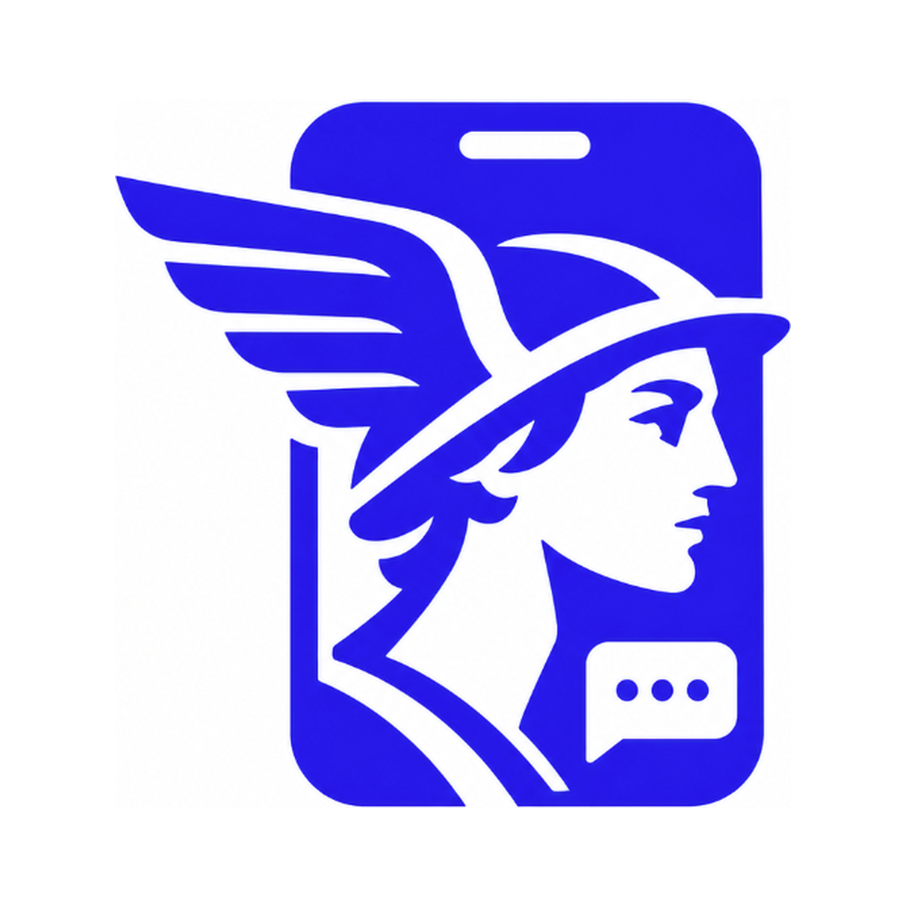

<p align="center">
  
</p>

<h1 align="center">Hermes Mobile</h1>

<p align="center">
  A polished cross-platform control surface for your running Hermes Desktop host.
</p>

<p align="center">
  <a href="https://github.com/CodeUpdaterBot/Hermes-Mobile-App">Mobile app source</a> ·
  <a href="https://hermes-agent.nousresearch.com/">Hermes Agent</a> ·
  <a href="https://hermes-agent.nousresearch.com/docs/">Documentation</a> ·
  <a href="https://discord.gg/NousResearch">Community</a>
</p>

## Why Hermes Mobile

I fell in love with Hermes, but could not find an Android client that let me control my Bots the way I wanted from my phone. Hermes Mobile is the companion I built: mobile-native, beautifully compact, and connected to the existing Hermes runtime rather than a second agent or copied provider credentials.

Your host PC remains the authority for agents, credentials, approvals, tools, sessions, files, and durable history. Hermes Mobile is the secure control surface in your pocket. Hope you enjoy it.

## Run locally

```bash
pnpm install
pnpm dev
pnpm test
pnpm build
pnpm tauri dev
```

### Android

On a machine with Android SDK:

```bash
pnpm tauri android init
pnpm tauri android dev
```

### iOS

On macOS with Xcode:

```bash
pnpm tauri ios init
pnpm tauri ios dev
```

## Current product capabilities

- **Live Hermes mirror:** Reads actual Bot profiles, canonical Bot Chats, session rows, transcripts, models, timestamps, and previews from the running Hermes host.
- **Live chat control:** Resumes a real Hermes session over `/api/ws` JSON-RPC, sends `prompt.submit`, and renders streamed assistant/tool activity.
- **Host-owned authority:** The app never starts a model/runtime and never copies provider credentials into the frontend.
- **Bot and Session views:** Bots are profile-owned canonical chats; Sessions is the all-profile runtime session projection.
- **Mobile-native controls:** Pull-to-refresh, attachment routing through Hermes, live skill completion, themes, profile settings, and cross-profile scheduled tasks.
- **Secure pairing readiness:** Security & Pairing uses the real Hermes `/api/status` discovery check for a supplied Tailscale/HTTPS gateway URL and provides the safe Android connection model. It deliberately does not collect or persist a credential until the Android/iOS native secure-storage token/OAuth flow is wired.

## Pair an Android phone safely

1. Install [Tailscale](https://tailscale.com/) on the Windows Hermes host and Android phone, then sign in to the same Tailnet.
2. Run a reachable, authenticated Hermes gateway on the Windows PC.
3. Enter the PC’s Tailscale gateway URL on the phone—never `127.0.0.1` or `localhost`, which point back to the phone.
4. Verify reachability, then authenticate with the gateway’s supported session-token or OAuth flow.
5. Keep Hermes port `9119` private. Do **not** expose it directly to the public internet.

Hermes Desktop’s official [multi-connection gateway guide](https://hermes-agent.nousresearch.com/docs/user-guide/multi-connection-desktop) describes the supported remote-gateway contracts and authentication options.

## Architecture

Read [ARCHITECTURE.md](ARCHITECTURE.md) before modifying the production bridge.

## Related projects

- [Hermes Mobile](https://github.com/CodeUpdaterBot/Hermes-Mobile-App)
- [Hermes Agent](https://github.com/NousResearch/hermes-agent)
- [Hermes Agent documentation](https://hermes-agent.nousresearch.com/docs/)
- [Nous Research Discord](https://discord.gg/NousResearch)
